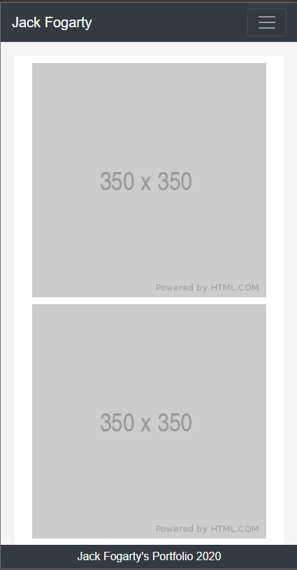

# Jack Fogarty's Portfolio
## Purpose of this Project
This project was created for the purpose of building a portfolio to display future coding projects. It was also a test of Bootcamp and its grid system.
## Goals of this Project
The primary goal of this project was to create a responsive portfolio, meaning that the layout of the page changes depending on the width of the device it is being viewed on - with the page condensing on mobile/tablets and expanding on laptops/desktops.

## Screenshots of Completed Project

## Links to Live Project
### https://foggles.github.io/Jack-Fogarty-s-Portfolio/index.html
### https://foggles.github.io/Jack-Fogarty-s-Portfolio/portfolio.html
### https://foggles.github.io/Jack-Fogarty-s-Portfolio/contact.html